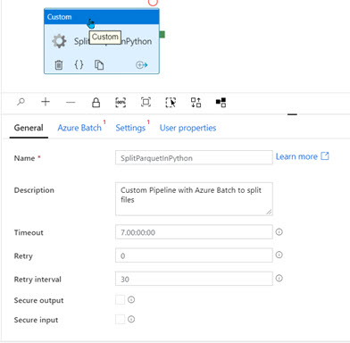

# Azure Batch Integration in Azure Data Factory

This tutorial explores a use case where large-scale datasets need to be processed in ADF (Azure Data Factory) in a scheduled manner while driving the entire transformation pipeline from ADF. It also provides a working example to test this concept by deploying a sample use-case. 

If you are new to Batch (Azure Batch) and ADF, you would still be able to explore this use-case by following along the instructions in this article, to learn more about both and how they work seamlessly together. 

### Azure Batch

Azure Batch is extremely useful to quickly deploy and scale high-performance computing applications efficiently in the cloud. You can schedule compute-intensive workloads to run on a collection of Virtual Machines (VMs). It is also possible to setup autoscaling to scale compute resources, depending on your workload requirements. 

Workloads can be executed on demand, or on a schedule and it is extremely easy to deploy, as we will see in the use case, without having to manage individual VMs, virtual networks etc. For Additional details on Batch, please refer to:

* [Basics of Batch](https://docs.microsoft.com/en-us/azure/azure-sql/database/sql-database-paas-overview)
* [Batch Feature Overview](https://docs.microsoft.com/en-us/azure/batch/batch-service-workflow-features)
* [Batch Documentation](https://docs.microsoft.com/en-us/azure/batch/batch-service-workflow-features)

### Azure Data Factory

Data Factory can help create managed data pipelines that move data from on-premises and cloud data stores to a centralized data store. For instance,  you can use Data Factory to process/transform data by using services such as Azure HDInsight and Azure Machine Learning. You also can schedule data pipelines to run in a scheduled manner (for example, hourly, daily, and weekly). You can monitor and manage the pipelines at a glance to identify issues and take action.

Additional details on Data Factory are available here:

* [Data Factor Introduction](https://docs.microsoft.com/en-us/azure/data-factory/v1/data-factory-introduction)
* [Tutorial: Building Data Pipelines with Data Factory](https://docs.microsoft.com/en-us/azure/data-factory/v1/data-factory-build-your-first-pipeline)


### Azure Data Factory and Azure Batch 

Azure Data Factory has two type of activities:

* [Data Movement](https://docs.microsoft.com/en-us/azure/data-factory/copy-activity-overview) : To move data between [supported sources](https://docs.microsoft.com/en-us/azure/data-factory/copy-activity-overview#supported-data-stores-and-formats) and [sink data stores](https://docs.microsoft.com/en-us/azure/data-factory/copy-activity-overview#supported-data-stores-and-formats)
* [Data Transformation](https://docs.microsoft.com/en-us/azure/data-factory/transform-data): To transform data during various compute services such as Azure HDInsigh, Azure Batch, Azure Machine learning etc. 

In addition to the above, there are often use-cases that are not directly supported by ADF, for example where you may need to transform the data in a certain way. For such operations, ADF provides an option for **Custom activity** where you can build your own transformation and processing logic and integrate this in the ADF pipeline as part of the flow. This Custom Activity would then run your code in the compute environment provided by Azure Batch, over a pool of virtual machines. 


### Azure Batch Architecture


### Use Case

I recently had a use case where there were data was being extracted out of SQL Managed Instance  on Azure. The data files were processed into parquet and multiple tables (of various size) could be written out in every extraction process. These parquet files, were of transactional in nature (staging) and hence were not partitioned as a) the skew could change every day 2) uneven distribution of data. 

The target of these files expected them to be up to 100MB and equally split, to be able to effectively load data in parallel for performance.

Hence, there was a need to pre-process and translate these files to fit the above requirements.  We are going to explore this use case with Azure Data Factory and Azure Batch.  


### Tutorial

We are going to setup everything step by step, and as long as you have an Azure account you would be able to follow along. In case you don't have one, you could sign up for a **free Azure account, that gives you 12 months of free services** [here](https://azure.microsoft.com/en-us/free/) and **Monthly Azure Credits for Visual Studio subscribers [here](https://azure.microsoft.com/en-us/pricing/member-offers/credit-for-visual-studio-subscribers/)**. We will go through the following steps:

* [Setup Storage](#setup-storage)
* [Setup Azure Data Factory](#setup-azure-data-factory)
* [Setup Azure Batch](#setup-azure-batch)
* [Create a simple pipeline in Data Factory](#create-a-simple-pipeline-in-data-factory)
* [Configure Azure Batch with Data Factory](#configure-azure-batch-with-data-factory)
* [Create a python script](#create-a-python-script)
* [Pass parameters to the Python Script](#pass-parameters-to-the-python-script)
* [Execute the pipeline](#execute-the-pipeline)
* [Monitor pipeline execution in Data Factory](#monitor-pipeline-execution-in-data-factory)
* [Monitor compute job in Azure Batch](#monitor-compute-job-in-azure-batch)


## Setup Storage

Once you have setup a resource group, the first thing we will deploy would be a storage account. This is where our source and target data will reside.

1. 

Configure 'Basics' as follows. 


During the lab, we would setup folders, so enable 'Hierarchical Namespace'.


Click 'Create'.


Once 'Storage Account' is setup, go to resource. We will set up 2 containers now. 

Click 'Containers'


Let's setup 2 containers: `filestoreage` as the source/target for the files that we will process and `batchstorage` for files that will be used by Azure Batch later. 


Navigate to `filestorage` and create 3 directories: `input`, `source`, `target`.


## Setup Azure Data Factory

Now we need to add an ADF instance to our resource group. Click ''+Add New' under 'Analytics' categrory.


Provide values as below, and click 'Create'.


Once the deployment is successful, go to Data Factory Overview screen and click on 'Author and Monitor' to launch the console.


The following screen will show up.


## Setup Azure Batch

For setting up Azure Batch, there are two things that we need to configure:

* Setup a Batch Account
* Create a pool of compute nodes

### Setup a Batch Account

Click 'Create a Resource' and then select 'Batch Service' from 'Compute' category.


Configure options as follows, and keep all other settings to default.  Click 'Create'.


Once the resource is deployed, open the resource to navigate to the Batch Account.


### Create  a Pool of Compute Nodes

Now that our batch account is setup, we would need to add compute where the actual processing will happen. This can be done in two ways:

* Adding Pool from Azure Portal
* Adding Pool from Batch Explorer

#### Adding Pool from Azure Portal (Optional)

The easiest option is to add a compute directly from the Portal. While it is very easy and straightforward to use, at the same time not all options are shown. If you use the Batch Explorer Client, you have many more options available. For this lab, we will use setup Pools using **Batch Explorer**. However, we will look at both options. *You can choose to not go through this section, since we will not be using this pool during the lab.*

To create a pool from Azure Portal, click 'Pools' in the 'Azure Batch' resource, and then click Add.


Setup the pool with settings below:


We will add just **1** dedicated node for this example. 


**Note**: If you plan to launch a customized image with components pre-installed, then you can also leverage the [custom-image functionality](https://docs.microsoft.com/en-us/azure/virtual-machines/linux/capture-image). 

Once the Pool is successfully deployed, you will be able to see the status in the Pools screen. 


Since we wouldn't be using this pool for the lab, you can delete it, to save resources. Right click on the Pool name, and select 'Delete'.

#### Adding Pool from Batch Explorer

To deploy a Pool from Batch Explorer, you must first **install Batch Explorer** on your local machine. This can be done from the Batch Account > Overview Page. Click 'Batch Explorer Option'.


Once you have downloaded and installed, open Batch Explorer' locally. It would require your 'credentials' and you'll be able to connect to your Azure Account. You will see all the Batch Accounts deployed in your Azure Account. 


Select your Batch Account in which you want to create a Pool. Then click 'Pools' on the left menu bar. Click '+' to add Pools.

Setup the options as below. We will use only 1 task per node and use only 1 node. 


Next we will choose the type of image that we want use for our compute instance. As you will see, there are a lot more options available in Batch Explorer, as compared to Portal. We will use 'Dsvm Windows' under Data Science, and choose 'Standard_f2s_v2' as the virtual machine size. 


During the lab, we will be using python to execute transformations on data. For that, let's install a few custom libraries to the compute resource. Since we will set these up in the 'Start Task', these will apply automatically to any clones to additional nodes that we deploy. 

Click 'Add a start task' under 'Start Task'.


In the 'Command Line' enter `cmd /c "pip install pandas dask pyarrow"`

Keep the 'User identity' as 'Pool User'.


Click 'Save and Close'.

The  pool will deploy, and once successfully deployed, it will be visible under 'Pools' on the left sub menu.


## Create a Simple Pipeline in Data Factory

Let's create a simple pipeline to source some data that we will use for testing and place it in the appropriate folder. 

Open Azure Data Factory per earlier instructions, and click on 'Create Pipeline'.


In this lab, we will use existing parquet files for airline dataset available [here](https://www.transtats.bts.gov/Tables.asp?DB_ID=120). While the data available at the source is substantial (1.4gb compressed), for this lab you can also download a sample parquet file (15MB) from the repo directory `sample-data`. 

*If you would like to simulate multiple files, then you can upload this file after renaming it.*

In a live use-case, this data could be an export out of a data warehouse/mart or OLTP, or could even be a output of an IOT process. It is beyond the scope of this lab, to create a pipeline for simulating this. Hence, we will start with an assumption that a parquet input file is available to us. 

Upload this file in your `filestorage` container, in the `input` directory.


Once the file is uploaded, we will setup a pipeline in Data Factory.


In this lab, we will:

* **Copy Data** from `input` folder to `source` folder using 'Copy Data'.

In the next section, we will then:

* Split this file into equal number of files, on the basis of parameters using **Custom Batch Service**.
* Parameterize this process, so it can work on multiple files across different folders, using the same code.

To create the first pipeline, drag and drop the 'Copy Data'


Change the name of the pipeline to 'CopyParquet' from 'pipeline1'.

In this pipeline, we will setup our `input` folder as the source, and `source` as the target. This is to also ensure that our original sample file is not modified,  especially if you run this pipeline multiple times. 

Change the name in the 'General' section to 'CopyFile'.

Click Source. Click '+ New' and select 'Azure Blob Storage' from the menu, as the source of our data. As you can see, ADF is able to pick up data from a variety of sources. 


Click 'Continue'. From the next screen, choose 'Parquet' as the format.


Click 'Continue'.

In the next screen, we need to setup a 'Linked Service' for the source location. 

Change the name from 'Parquet1' to 'SourceParquet'. Click 'Linked Service' and 'Add New'.


In the next screen, we will setup the credentials to access our source location.

Change the name from 'AzureBlobStorage1' to 'SourceBlobStorage'.

For authentication method, various options are available. We will choose 'Account Key'.

You would need the following details:

* Storage Account Name
* Storage Account Key
* Endpoint suffix

For this lab, we will use 'Azure Subscription', instead of providing all of these manually.

Setup the options as below, and 'Test connection.'


In the next screen, we will define the path for the file(s) location.

You can either manually type the path, or use the button to select it. 


In this scenario, we want all files of .parq extension to be picked up automatically, you can do so by editing wildcards as a selection criteria. You can modify this under the 'Source' tab.


Similarly, setup the 'Sink'. 

Under 'Sink', 'Sink Dataset', click '+ New'.

Since our target is also an Azure Blob Storage, select that from options, and the output is again going to be a parquet file.

Give the name 'TargetParquet' and create another New 'Linked Service'.

Name it 'TargetBlobStorage' and follow the same process as above to setup the link. Test Connection. Create.


Now choose the `source` folder as your destination. Select 'None' under 'Import schema'. We are choosing `source` as this will be our source folder for the transformation process.

Click Ok. 

Let's name our target file as 'NewFile.parq'.

Click 'Sink' > Open 'TargetParquet' and enter the filename. There are option for parameterization, but we'll skip that for now.


We want to setup this pipeline in a way that it will merge multiple files into a single output file. Under 'Sink', select 'Merge Files' as the 'Copy  Behaviour'.

Let's validate that there are no issues in our pipeline. 

Click 'Validate All' on the top left of the screen. Once it succeeds, click 'Publish all' to commit changes. This will deploy all changes to Data Factory. Once you get a alert 'Publishing Completed', our pipeline is ready.

Before we start this, let's validate that there is no data in either source or target directory.


To execute this pipeline, click 'Add Trigger' > 'Trigger Now'. Click Ok.


In a few mins, you'll get a notification that the pipeline has succeeded.


The file 'NewFile.parq' has been create in the `source` folder.


## Configure Azure Batch with Data Factory

The only setup that is required in ADF for invoking Azure Batch compute in the pipeline is to setup a linked service. 

Let's drag a 'Custom' activity into our canvas.


Let's name it 'SplitParquetInPython'.



In the 'Azure Batch' tab, add the Batch Account that was created in the previous steps as a Linked Service, and Test Connection to ensure that it is successful. 

To configure this, we would need:

* Account Name
* Access Key
* Batch URL
* Pool Name

This information is available in your Batch Account, under Keys:


We would also need the Pool name and the Batch Storage Linked Service. The purpose of Batch Storage Linked Service is to store any files and other data that might be required by the compute during execution. It is important to note that any data that will be there in the folder linked with Batch Storage, will be copied over to the node during an execution (we will monitor this later), hence keep only the files that you need to reference in the code. In our case, this will be the python script. 

Create a Storage Linked Service, by clicking 'New'. 

Let's call it 'BatchStorageBlob'. Just like the previous storage accounts, let's configure it and point it to the container 'batchstorage' that we had set up in our storage account.


The Azure Batch Linked Service Screen would be as follows:


Test Connection and click 'Create'.

The last thing to now configure in this section, is the actual command that will be invoked when this compute process executes as part of the pipeline.

Click the 'Settings' tab on Azure Batch and configure as follows:

Command: `python splitparquet.py`

Resource Linked Service: Select the 'BatchStorageBlob' linked service that we created in the previous steps. 

Folder Path: This will be the folder where the above python script is located. In our case, we will place this in the root folder, and hence select the name of the container itself. 


```

```


### Create A Python Script

The script `splitparquet.py` is available in the 'scripts' folder in this repo. 

Let's walk through the key segments:

We'll be using pyarrow to read the data from the source parquet and BytesIO to write back the split files directly into Azure Storage, as a blog object without using any temporary location.

```
from __future__ import print_function
from azure.storage.blob import BlockBlobService
from azure.storage.blob.models import Blob, BlobProperties
from io import BytesIO
import pyarrow as pa
import pyarrow.parquet as pq
import sys
```

This function reads the source file and returns a Pandas DataFrame.

```
def get_pandas_dataframe_from_parquet_on_blob(blob_service, container_name, blob_name):
    """ Get a dataframe from Parquet file on blob storage """
    byte_stream = BytesIO()
    try:
        blob_service.get_blob_to_stream(
            container_name=container_name, blob_name=blob_name, stream=byte_stream
        )
        df = pq.read_table(source=byte_stream).to_pandas()
    finally:
        byte_stream.close()
    return df
```

This function writes back a bytestream to BlobStorage, from a DataFrame

```
def write_pandas_dataframe_to_blob(blob_service, df, container_name, blob_name):
    """ Write Pandas dataframe to blob storage """
    buffer = BytesIO()
    df.to_parquet(buffer)
    blob_service.create_blob_from_bytes(
        container_name=container_name, blob_name=blob_name, blob=buffer.getvalue()
    )
```

This function calculates the size of the source blob. This is used by the program later to identify the compression factor, for the splits to be written.

```
def get_blob_size(blob_service, container_name, blob_name):
    """ Get the size of the blob object to calculate compression factor """
    length = blob_service.get_blob_properties(container_name, blob_name).properties.content_length
    return length
```

The main function. Initially, this code was written with discrete parameters for the Storage Account Name where the source and the target files would reside. Later this was optimized to receive this as an argument from the pipeline itself. If you are doing a unit test, you can input the values here itself and comment out the `sys.argv` segment.

```
def main():
    kilobytes = 1024
    megabytes = kilobytes * 1024
    chunkSize = int(10 * megabytes)
    compressFactor = 10
    blobSize = 0
    dataFrameSize = 0
    newFileSize = 0
	
    storageAccountName = ""
    storageKey         = ""
    containerName      = ""
    outputFolder       = ""
    blobName 		   = ""
```

This section receives the parameters from command line. Currently, in our Batch Service, we have hardcoded `python splitparquet.py` . Later we will modify it to make it dynamic. 

```
    storageAccountName = sys.argv[1]
    storageKey = sys.argv[2]
    containerName = sys.argv[3]
    outputFolder = sys.argv[4]
    blobName = sys.argv[5]
    chunkSize = int(sys.argv[6])
    chunkSize = int(chunkSize * megabytes)
```

Create a blobService object and identify the size of the parquet file.

```
    blobService = BlockBlobService(account_name=storageAccountName,
                                   account_key=storageKey
                                   )
    
    blobSize = get_blob_size(blobService, containerName, blobName)
```

Read the Parquet blob in memory using pyarrow

```
    rdf = get_pandas_dataframe_from_parquet_on_blob(blobService, containerName, blobName)
```

Calculate the space that the dataframe occupies. Since parquet are often written with compression (snappy), this was written to compute the actual size of the dataset.

```
	dataFrameSize = rdf.memory_usage(index=True).sum()
```

Calculate how much compression was applied on to the original source file.

```
    compressFactor = dataFrameSize / blobSize
```

Based on compression factor, chunksize (desired file size in MB given by user for every split) , compute the bytestream that will be written out as a new parquet segment

```
    splits = int((dataFrameSize / (chunkSize * compressFactor)) + 1)
```

Compute how many records fit in the memory segment that will be written out

```
    numofrecords = len(rdf)
    rowstart = 0
    rowincrement = round(numofrecords / splits) - 1
    rowend = rowincrement
```

Output that will be written out to see the statistics at the end of the compute job

```
    print(f"Total records in the original file: {numofrecords:,}")
    print(f"Total Size of the Blog File : {blobName} is {blobSize:,} bytes or {(blobSize / megabytes):.2f} MB")
    print(f"The files will be split in chunks of upto {(chunkSize / megabytes):.2f} MB similar splits")
    print(f"Total memory in use by DataFrame: {dataFrameSize:,} bytes or {(dataFrameSize / megabytes):.2f} MB")
    print(f"The compression factor being used to split files is: {compressFactor:.2f}")
    print(f"The resulting parquet will be split into {splits} files")
    print(f"Total Records written per file will be: {rowincrement:,} ")
```

Sequence that will invoke the function and execute the entire splitting workflow

```
x = 1
    for x in range(splits):
        filename = 'part%04d' %x + '.parq'
        if x == splits - 1:
            rowend = numofrecords
        write_pandas_dataframe_to_blob(blobService, rdf.iloc[rowstart:rowend], containerName, (outputFolder + filename))
        rowstart = rowend + 1
        rowend += rowincrement
        xdf =  get_pandas_dataframe_from_parquet_on_blob(blobService, containerName, (outputFolder + filename))
        newFileSize = get_blob_size(blobService, containerName, (outputFolder + filename))
        print(f"Validating the # of records written in file: {filename} is {len(xdf):,} Size: {(newFileSize / megabytes):.2f} MB")
    exit(0)

main()
```

### Pass Parameters to the Python Script

In our pipeline, we can setup parameters and variables that can be leveraged by different activities in our pipeline. 

Since our python script would need to know the directory where the parquet files are to be read/written to, it needs the credentials of the storage account. As opposed to hard coding them in the script, it is a better approach to pass them dynamically as part of the pipeline. 

You would need the following information:

* Container Name: Container for Input/Output. (Current script assumes same for both)
* Storage Account Name: Storage Account Name for the above container.
* Storage Key: Available under 'Access Keys' for the storage account
* Output Folder: Folder where the output will be written
* blobName: The output file that is read as a source. In our previous step, we create the file NewFile.parq in the 'source folder'
* FileChunkSize: The desired file size (in MB) for every split.

These can be configured in the Data Factory Canvas. Deselect all activities and setup the following variables in the 'Variables' tab.


These parameters can also be modified as part of the pipeline using the 'Set Variable' activity available under 'General'.

Now let's modify our 'Custom Activity' 'SplitParquetInPython' to pass these parameters at run time. 

Replace the Command `python splitparquet.py` with:

```
@concat('python splitparquet.py',' ',variables('storageAccountName'),' ',variables('storageKey'),' ',variables('containerName'),' ',variables('outputFolder'),' ',variables('blobName'),' ',variables('fileChunkSize'))
```


Finally, let's link our two activities 'CopyFile' and 'SplitParquetInPython' so that they trigger in sequence. This can be done by clicking and dragging the green box icon at the edge of the activity to the other activity to be linked with.


The two are now linked.


Validate your pipeline for any errors. Publish All.

### Execute the Pipeline

Now let's execute the entire flow. 

Before you execute the trigger:

* Check that you have uploaded the python script to the 'Batch Storage' folder.
* Delete the 'NewFile.parq' from the 'filestorage/source' folder since the file will be created again.

Execute the pipeline by clicking 'Add trigger' > 'Trigger Now'.

### Monitor Pipeline Execution In Data Factory

Once the job has been submitted, we can track the execution of the Pipeline in the 'Monitor tab'.


The Pipeline run shows up as 'In Progress'. Let's click on 'CopyParquet' to find more details.

We can observe the status of the job. Currently it is in 'Queued' state.


When we refresh the status in a few seconds, we notice that the status has now changed to 'In Progress' for the first activity 'CopyFile'.

We can find additional details, by clicking the 'Details' link.


The next screen shows us additional information about the 'CopyFile' activity. Since this activity moves data between our two directories, we can track the progress here. 


Similarly, once the second activity 'SplitParquetInPython' completes, the status is reflected here as well. For this activity, we see that there is an input and output detail available. 


The Input detail provides the following information on the inputs that this activity received. We can see that the python script is being invoked with all the parameters.


The output of this activity provides the details on the execution of this activity in the pool. We can also track the billable duration of this task, especially for dynamic on-the-fly pools.


References:

[Using custom activities in Azure Data Factory Pipeline](https://docs.microsoft.com/en-us/azure/data-factory/transform-data-using-dotnet-custom-activity)

[Process large-scale datasets by using Data Factory and Batch](https://docs.microsoft.com/en-us/azure/data-factory/v1/data-factory-data-processing-using-batch)

[Tutorial : Run python scripts through Azure Dat Factory using Azure Batch](https://docs.microsoft.com/en-us/azure/batch/tutorial-run-python-batch-azure-data-factory)

​	